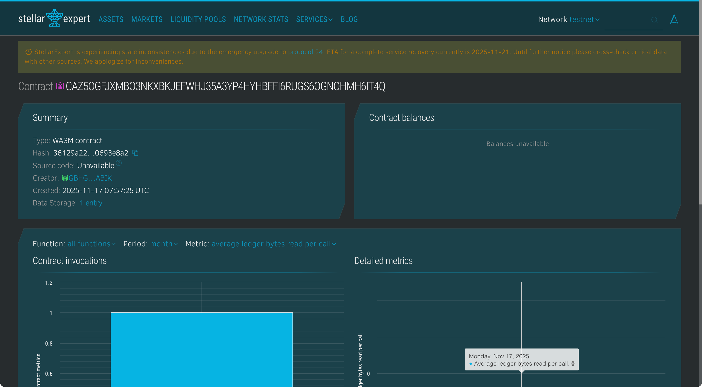

# Crypto Borrow Vault

## Project Title

**Crypto Borrow Vault** - Decentralized Collateral-Based Micro Lending Platform

## Project Description

Crypto Borrow Vault is a blockchain-based smart contract built on the Stellar/Soroban network that enables users to obtain instant micro-loans by depositing cryptocurrency as collateral. The system implements a secure, trustless lending mechanism where borrowers can access liquidity (up to 70% of their collateral value) without selling their crypto assets. The smart contract manages all loan operations including collateral deposits, loan disbursements, and repayments autonomously.

## Project Vision

Our vision is to democratize access to financial services by creating a transparent, permissionless lending platform that:

- Eliminates intermediaries and reduces borrowing costs
- Provides instant liquidity without credit checks or lengthy approval processes
- Maintains user sovereignty over their assets through blockchain technology
- Enables micro-borrowing opportunities for the underbanked and unbanked populations
- Creates a foundation for a more inclusive and accessible decentralized finance (DeFi) ecosystem

We envision Crypto Borrow Vault becoming a cornerstone infrastructure for:

- Emergency financial needs without asset liquidation
- Short-term liquidity for traders and investors
- Cross-border lending without geographical restrictions
- Building credit history on-chain for future financial opportunities

## Key Features

### 1. **Collateral-Based Borrowing**

- Users deposit tokenized assets as collateral to secure loans
- Automatic loan calculation: borrow up to 70% of collateral value
- Over-collateralization ensures vault solvency and lender protection

### 2. **Instant Loan Approval**

- No credit checks or manual approval processes
- Smart contract automatically validates collateral and disburses loans
- Real-time execution within seconds on the Stellar network

### 3. **Transparent & Trustless**

- All transactions recorded immutably on the blockchain
- Smart contract logic is open-source and auditable
- No centralized authority controls user funds

### 4. **Simple Repayment Mechanism**

- One-click loan repayment to unlock collateral
- Automatic collateral release upon successful repayment
- Clear loan status tracking for each borrower

### 5. **Vault Statistics & Monitoring**

- Real-time tracking of total loans issued
- Transparent view of total collateral locked in the vault
- Individual loan detail queries for borrowers

## Contract Details
- Contract Address: CAZ5OGFJXMBO3NKXBKJEFWHJ35A3YP4HYHBFFI6RUGS6OGNOHMH6IT4Q

## Future Scope

### Phase 1: Enhanced Functionality

- **Dynamic Interest Rates**: Implement time-based interest calculations for loans
- **Multiple Collateral Types**: Support for various tokenized assets (real estate, stocks, NFTs)
- **Liquidation Mechanism**: Automatic collateral liquidation if value drops below threshold
- **Partial Repayments**: Allow borrowers to repay loans in installments

### Phase 2: Advanced Features

- **Variable Loan-to-Value (LTV) Ratios**: Customizable borrowing percentages based on asset volatility
- **Flash Loans**: Uncollateralized loans for arbitrage opportunities within single transactions
- **Credit Scoring System**: On-chain reputation building based on repayment history
- **Multi-Signature Admin Controls**: Decentralized governance for protocol upgrades

### Phase 3: Ecosystem Expansion

- **Cross-Chain Integration**: Enable collateral deposits from multiple blockchain networks
- **Lending Pools**: Allow lenders to provide liquidity and earn yield
- **Insurance Mechanisms**: Protect against smart contract vulnerabilities and market crashes
- **Mobile Application**: User-friendly mobile interface for broader accessibility

### Phase 4: Regulatory & Scalability

- **Compliance Framework**: Integration with identity verification for regulatory markets
- **Layer 2 Scaling**: Implementation of scaling solutions for higher transaction throughput
- **Oracle Integration**: Real-time asset price feeds for accurate collateral valuation
- **DAO Governance**: Community-driven decision making for protocol parameters

### Long-term Vision

- Establish partnerships with traditional financial institutions for hybrid lending models
- Create a global network of decentralized lending vaults across multiple blockchains
- Develop AI-powered risk assessment tools for optimized lending strategies
- Pioneer new financial products combining DeFi innovation with real-world asset tokenization

---

## Technical Stack

- **Blockchain**: Stellar Network
- **Smart Contract Framework**: Soroban SDK (Rust)
- **Storage**: On-chain persistent storage with TTL management

## Getting Started

1. Deploy the smart contract to Stellar testnet/mainnet
2. Users authenticate and call `borrow()` with collateral amount
3. Smart contract calculates and disburses 70% of collateral value
4. Users call `repay()` to settle loan and retrieve collateral
5. Monitor vault health with `view_vault_stats()`

## Security Considerations

- All critical functions require caller authentication (`require_auth()`)
- Prevents multiple active loans per borrower
- Immutable loan records ensure transparency and auditability

---

**Built with ❤️ on Stellar Soroban**
